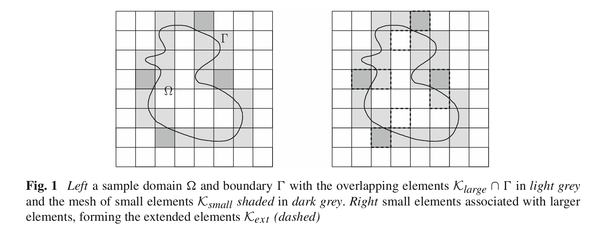

# cutDG / unfitted DG method

## literature review
### Fictitious domain formulations
- Glowinski et al. developed fictitious domain methods for FEM, applied to electromagnetics, elliptic problems, and fluid flow around moving rigid bodies.
- These methods embed a complex geometry into a simple background mesh, introducing Lagrange multipliers or penalty terms to impose boundary conditions on the embedded boundary.

### XFEM and enrichment-based unfitted approaches
- Moes et al. introduced the Extended Finite Element Method (XFEM) based on the Partition of Unity Method (PUM).
- XFEM enriches basis functions to represent discontinuities (e.g., cracks) without remeshing.
- XFEM has been extended to two-phase flows, dendritic solidification, shock capturing, FSI, and fractured porous media.

### Hansbo & Hansbo proposed an alternative unfitted FE method using Nitsche-type weak enforcement of interface conditions.
- Provided optimal a priori/a posteriori error estimates independent of interface position.
- Later extended to elasticity problems with strong/weak discontinuities.
- Areias & Belytschko showed equivalence with XFEM via Heaviside enrichment.

### Ghost penalty stabilization
- A key development was extending pressure-jump stabilization from only the physical interfaces to entire faces of cut elements.
- This led to the first ghost penalty stabilized unfitted FEM.
- Ghost penalties provide:
  - stability independent of cut configuration
  - well-behaved condition numbers
  - extension of coercivity and norm control to the entire active mesh

### CutFEM framework
- CutFEM generalized these ideas into a unified, theoretically grounded unfitted finite element framework.
- Ghost penalty stabilizations allow transferring stability and approximation properties from fitted FEM to cut FEM.
- Applications span:
  - elliptic interface problems
  - Stokes/Navier–Stokes systems
  - two-phase flow and FSI
  - surface and surface–bulk PDEs (TraceFEM)

### Other unfitted finite element methods
Includes:
- Finite Cell Method
- Immersed Boundary FEM
- Immersed FEM
all of which rely on background meshes with embedded geometries.

### Unfitted discontinuous Galerkin methods
- Unfitted DG methods treat cut elements by **merging small cut cells with neighboring large cells.** (Cell Agglomeration)
- Because continuity is weakly enforced, basis functions can be extended naturally.
- Advantages:
  - Stable and conservative schemes
  - Avoid ghost penalties
- Drawbacks:
  - Limited numerical analysis
  - Complex implementation (due to matrix sparsity changes)
  - No natural extension to surface PDEs
- Recent work extends cell-merging ideas to continuous FEM as well.

## Cell Agglomeration technique
**Reference:**  
*Johansson, A., Larson, M.G. A high order discontinuous Galerkin Nitsche method for elliptic problems with fictitious boundary. Numer. Math. 123, 607–628 (2013). https://doi.org/10.1007/s00211-012-0497-1*

### ⭐ Core Idea  
The paper develops a high-order unfitted Discontinuous Galerkin (DG) method based on Nitsche’s formulation for elliptic problems defined on fictitious domains. The key technique is to stabilize small–cut elements by associating them with neighboring larger elements.

### 🔧 Method Overview  
- Introduces **extended elements** by merging small–cut cells with adjacent larger cells.  

- DG basis functions remain easy to define on these extended elements even when their shapes become irregular.  
- Uses this extended partition to naturally construct a stable DG bilinear form via Nitsche’s method.  

### 📐 Theoretical Results  
- **Discrete inverse inequality and trace inequality** can be proved on extended elements, leading to well-posedness.
- The stiffness matrix constructed on extended meshes has a condition number of order  
  $$\kappa(A) = O(h^{-2}),$$
  matching that of standard fitted FEM.  
- Optimal convergence in both $L^2$ and $H^1$ norms is achieved.
- The result is suitable for high order method.

### 🧪 Implementation Notes  
- Stability heavily relies on correctly detecting small–cut elements and merging them (But the choices of large elements have little influence on accuracy and convergence rates). 
- Requires a consistent extension of basis functions across merged elements.

### 🔗 Relevance to My Work  
- Useful for designing stable cutDG / unfitted DG schemes.
- The extended-element strategy might inspire stabilization choices in my EDFM or fracture-flow codes.

### 💭 Personal Comments  
- A clean and classical reference for understanding small–cut stabilization in unfitted DG.  
- The extended-element concept might be more difficult to realize in FEM since the basis functions are hard to properly define.

## Ghost penalty technique
**Reference:**  
*Gürkan, C., Massing, A. A stabilized cut discontinuous Galerkin framework for elliptic boundary value and interface problems. Computer Methods in Applied Mechanics and Engineering, 348, 466-499 (2019).*

### ⭐ Core Idea  
- Proposed a stabilized **cutDG framework** that extends ghost penalty techniques from continuous CutFEM to DG discretizations.  
- The approach is minimally invasive for existing fitted DG codes, requiring only additional cut-cell quadrature while preserving the original sparsity pattern.  
- Boundary and interface conditions are imposed via **Nitsche’s method**, and stability and optimal a priori error estimates for elliptic problems are established.  
- Identify **four abstract ghost-penalty assumptions**: two guarantee stability and optimal approximation, and two ensure geometry-robust condition numbers.  
- Several realizations of ghost penalties satisfying these assumptions are presented and analyzed.  
- Extensive 2D/3D experiments confirm the theoretical results and illustrate the behavior of the stabilization mechanisms.

### 🔧 Method Overview  

### 📐 Theoretical Results  

### 🧪 Implementation Notes  

### 🔗 Relevance to My Work  

### 💭 Personal Comments  

